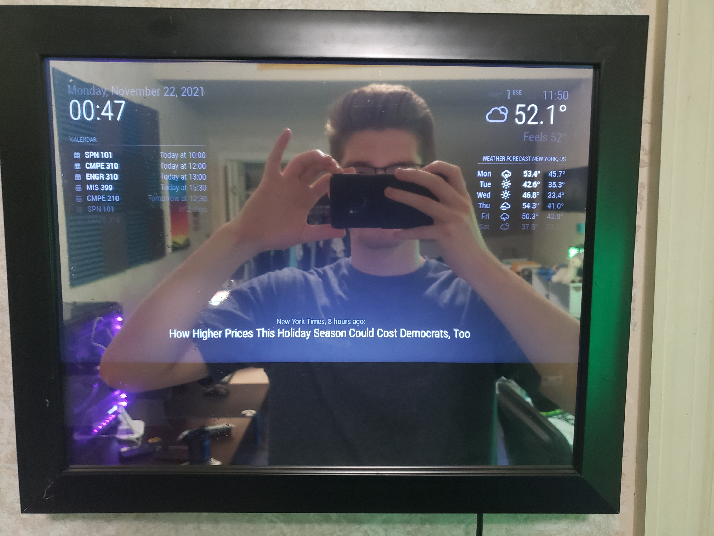
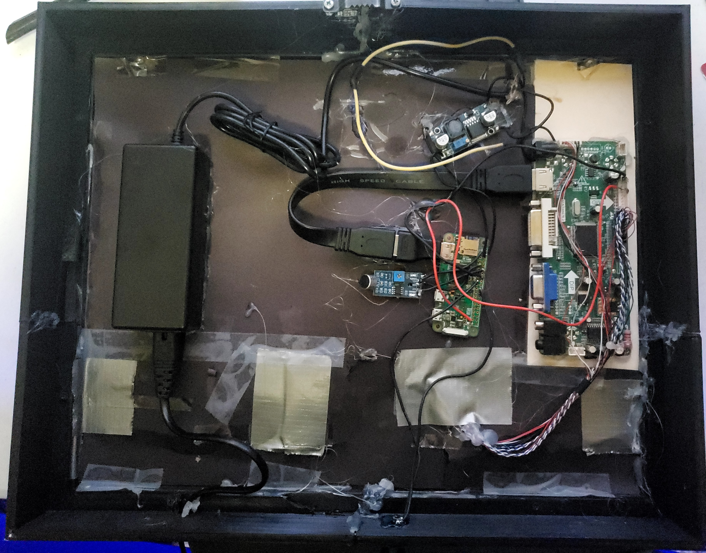
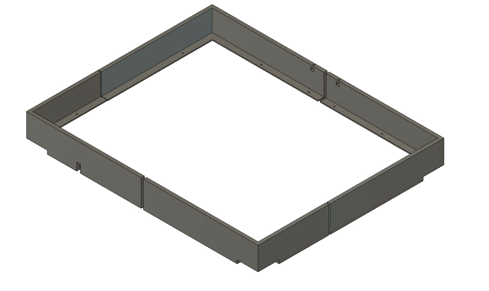

# Magic Mirror
This is a magic mirror (also known as a smart mirror) I made on a budget. The principle is just a monitor behind a piece of one-way reflective film/mirror.  

## Parts list
| Part | Location |
| --- | --- |
| Raspberry pi Zero | [Adafruit Industries](https://www.adafruit.com/product/3708)|
| Frame | [Amazon](https://www.amazon.com/dp/B071F7Z9K6) |
| One-way film | [eBay](https://www.ebay.com/itm/323711433064) |
| 12V 5A Power supply | [Amazon](https://www.amazon.com/gp/product/B06Y64QLBM) |
| Monitor | [Amazon](https://www.amazon.com/dp/B015GDVL30) |
| Monitor driver (monitor dependent) | [eBay](https://www.ebay.com/itm/153655340641) |
| Buck Converter | [Amazon](https://www.amazon.com/gp/product/B07VVXF7YX) |
| AVR Sound detection modules | [Amazon](https://www.amazon.com/gp/product/B07CQZ93N4) |
| Button | [Amazon](https://www.amazon.com/dp/B0852QJ8PJ/) |

# Build Guide

## Hardware
To make the end result look the best, make sure your monitor fits exactly in your frame. If the frame is larger than the monitor, you can see where the monitor stops when viewed from an angle, giving up the illusion.

This section is obviously dependent on what frame you get, but I made a 3d printed outline for my frame to make space for the components behind the mirror, located in `frame_brackets`.  

I don't feel like making a circuit diagram for this, due to the nature of how miscellaneous the parts are, so I will verbally describe it.
Connections:
- Power goes from power supply to buck converter & monitor driver board
- HDMI from PI to monitor driver board.
- Buck Converter powers the rasperry pi (5V)
- The monitor driver board connects to the monitor.
- The rest are GPIO connections to the PI.
  

| PIN | Location (in a frustrating order) |
| --- | --- |
| 4 | buck converter + |
| 6 | buck converter - |
| 1 | sound detection module VCC |
| 9 | sound detection module GND |
| 12 | sound detection module SIGNAL |
| 17 | power button |
| 22 | power button |
| 16 | monitor driver board pin 1 (see below) |
| 39 | monitor driver board pin 4 (see below) |

  

----
## Software

For a raspberry Pi Zero, the guide I followed was (with a few tweaks):
https://raw.githubusercontent.com/ac2799/MagicMirror/master/PiZero%20Magic%20Mirror%20Installation%20(LRes).pdf

Guide Recommendations:
- Use (balaenaEtcher)[https://www.balena.io/etcher/] to write the IMG file
- Make sure you use Raspbian Stretch. Newer Raspbian images like bullseye cause an `Illegal Instruction` error for chromium.
- After running the installer, which can be found here: (there's a typo in the PDF)
`https://raw.githubusercontent.com/ac2799/MagicMirror/master/installers/raspberry.sh`
You might get an error saying the MagicMirror couldn't be started. This is because of an error with how the installer encodes the home directory.
- In the following files, change ~ to /home/pi (or whatever your home directory is):
`MagicMirror/installers/startMagicMirrorPi0.sh`
`MagicMirror/installers/pm2_MagicMirrorPi0.json`
- Add `export DISPLAY=:0` to `MagicMirror/installers/startMagicMirrorPi0.sh` or the GUI programs might not work

Put your config file `config.js` in `MagicMirror/config/config.js`

To turn the screen on and off, I used a button and a sound detection module that triggered on a double clap (like a clapper). That file is `toggle_screen`. Put it somewhere and add it to crontab. `crontab -e` and add the line `@reboot /home/pi/toggle_screen`. The uploaded version has the mic disabled for convenience, but it can easily be enabled by just recompiling the code with the mic section uncommented. The code assumes a keyboard key is used, so it automatically performs software debouncing.

To disable sleeping, `vi /etc/lightdm/lightdm.conf` and edit line to `xserver-command=X -s 0 -dpms`